```{=html}
<style>
body {
text-align: justify
}
</style>
```
```{r setup, include=FALSE}
# General settings     
knitr::opts_chunk$set(
	echo=FALSE,
	fig.align = "center",
	fig.show = "hold",
	message = FALSE,
	error = FALSE,
	warning = FALSE,
	collapse = TRUE,
    results = 'asis')
```

<br>

[{height="140"}](https://datactivist.coop/fr/)             [{height="100"}](https://wikimediafoundation.org)             [{height="90"}](https://fr.vikidia.org/wiki/Vikidia:Accueil)

<br>

Avec plus de 30.000 articles et 60.000 utilisateurs, Vikidia est une ressource en ligne incontournable pour les 8-13 ans. Cette encyclopédie collaborative a connu une croissance importante depuis sa création en 2006.

Dans ce contexte où l'utilisation de Vikidia est de plus en plus importante, l'association française Wikimédia a été chargée d'organiser une enquête auprès de la communauté vikidienne.

De juin à octobre 2021 798 réponses ont été collectées, quantitatives comme qualitatives, dans le but de connaître mieux la communauté (contributeurs, lecteurs etc.).

------------------------------------------------------------------------

<br>

# I - Préparation des données

<br>

Dans le but d'analyser les résultats de l'enquête, un **nettoyage des données** est nécessaire. Ainsi, les réponses au séquentiel 474 et 475 sont retirées car elles font ***doublons*** avec la réponse 473. De même, certaines réponses ***incohérentes ou peu fiables*** au vu des champs libres complétés, sont supprimées. Cela concerne les réponses 43, 75, 317, 465, 479, 484, 498, 499, 524, 537, 594, 598, 613, 614, 621, 630, 676, 677, 717, 722, 780 et 793. Les données analysées comportent donc les réponses de 774 répondants.

Dans un deuxième temps, certaines réponses aux questions suivantes sont traitées :

-   **question *"En quelle année avez-vous rejoint la communauté Vikidienne ?"*** : extraction de l'année lorsqu'elle est citée à l'aide d'une fonction, puis traitement à la main des autres types de réponses (exemple : "*il y a 4 ans*") ;
-   **question *"Qu'est ce qui vous a motivé à contribuer pour la première fois ?"*** : regroupement, lemmatisation et harmonisation des réponses à la main ;
-   **question *"Lorsque vous ne trouvez pas des informations sur Vikidia, où allez-vous en priorité ?"*** : standardisation des réponses (sans accent et en minuscules), extraction des mots-clés / des réponses les plus courantes, puis traitement manuel de ces réponses pour les lemmatiser ;
-   **questions *"Vous êtes ..."* et *"Veuillez préciser votre niveau d'étude"*** : agrégation des deux champs ; le détail du niveau d'étude est collé à l'activité du répondant (exemple : '*Étudiant/élève*' et '*École primaire (du CP au CM2)*', devient "*Élève en école primaire*").

Enfin, une variable additionnelle est créée dans le but de distinguer les lecteurs des contributeurs, elle est basée sur les réponses à la question "*Quel est votre degré de contribution ?*".

<br>

Les parties suivantes présentent l'analyse des réponses à l'enquête, sous 4 objectifs définis :

-   rendre compte de la variété des profils ;
-   dresser le profil du contributeur moyen ;
-   cerner les usages ;
-   analyser les besoins des utilisateurs.

Le questionnaire est analysé de manière visuelle ; chaque datavisualistion permet de représenter les réponses à une ou plusieurs questions. Pour chaque datavisualisation, une mise en contexte est effectuée avant d'en interpréter les résultats.

<br>

------------------------------------------------------------------------

# II - Rendre compte de la variété des profils

<br>

## Genre des répondants de l'enquête

<br>

-   **population** : tous les répondants

-   **nombre de répondants** : 774

-   **question représentée et ses réponses issues du questionnaire** :

    -   "*Êtes vous ...*" : 'Un homme', 'Une femme', 'Autre', 'Je préfère ne pas le dire'

<br>

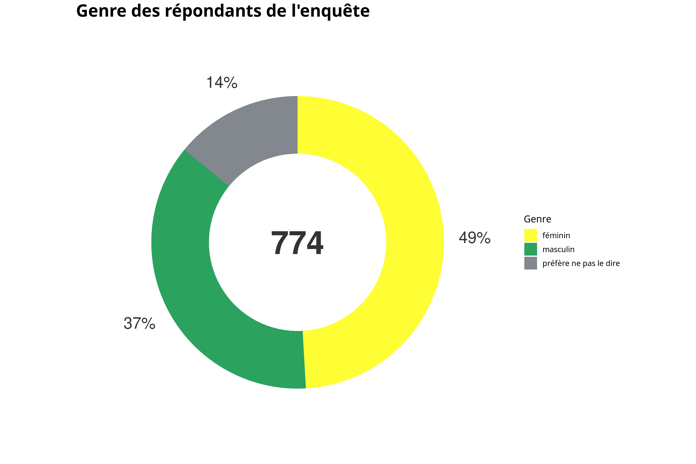

La visualisation ci-dessus montre la répartition des répondants selon leur genre. Sur 774 répondants ; 380 sont des femmes, soit 49%, 285 sont des hommes, soit 37%, et 109 préfèrent ne pas le dire, soit 14%.

------------------------------------------------------------------------

<br>

## Nombre de répondants selon l'âge et le genre

<br>

-   **population** : les répondants de genre féminin ou masculin (suppression de la catégorie "*Préfère ne pas le dire*")

-   **nombre de répondants** : 665

-   **questions représentées et leurs réponses issues du questionnaire** :

    -   "*Êtes vous ...*" : 'Un homme', 'Une femme', 'Autre', 'Je préfère ne pas le dire'
    -   "*Quel âge avez-vous ?*" : 'Moins de 8 ans', 'Entre 8 et 13 ans', 'Entre 14 et 18 ans', 'Entre 19 et 25 ans', 'Entre 26 et 35 ans', 'Entre 36 et 50 ans', 'Entre 51 et 60 ans', 'Plus de 60 ans', 'Je préfère ne pas le dire'

<br>

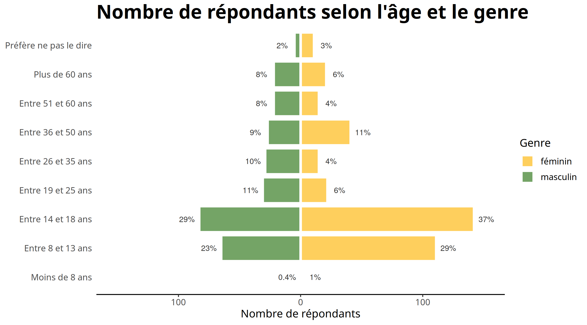

La visualisation ci-dessus montre la répartition des répondants selon leur âge et leur genre. On voit que la catégorie regroupant le plus de répondants est celle des filles ayant entre 14 et 18 ans, qui représente 21% de la population. Elle est suivie par la tranche des moins de 14 ans où l'on retrouve 113 filles, soit 17% des répondants. 


------------------------------------------------------------------------

<br>

## Nombre de répondants selon l'activité et le genre

<br>

-   **population** : les répondants de genre féminin ou masculin

-   **nombre de répondants** : 665

-   **questions représentées et leurs réponses issues du questionnaire** :

    -   "*Êtes vous ...*" : 'Un homme', 'Une femme', 'Autre', 'Je préfère ne pas le dire'
    -   "*Vous êtes ...*" : 'En activité', 'En recherche d’emploi', 'Retraité', 'Étudiant, élève' ('*Veuillez préciser le niveau d’étude :*' : 'École primaire (du CP au CM2)', 'Collège', 'Lycée', 'Études supérieures')

<br>

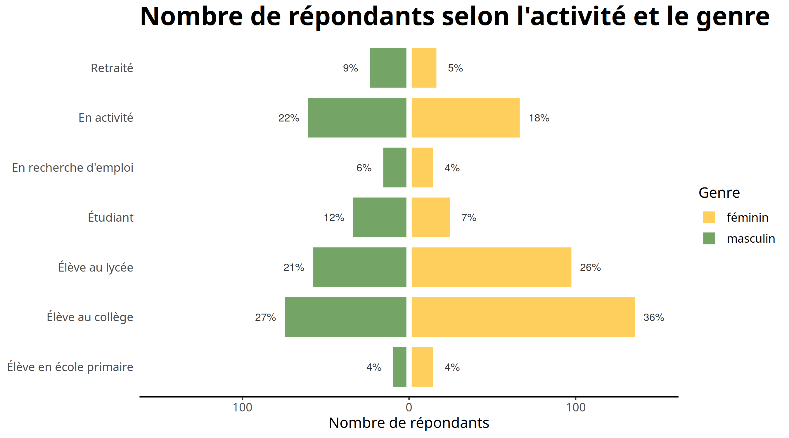

La visualisation ci-dessus montre . 


------------------------------------------------------------------------

<br>

## Les contextes d'utilisation de Vikidia

<br>

-   **population** : tous les répondants

-   **nombre de réponses** : 1407

-   **question représentée et ses réponses issues du questionnaire** :

    -   "*Dans quel(s) contexte(s) utilisez-vous Vikidia ?*" : 'Dans le cadre scolaire à la maison (voir les devoirs, les révisions etc.)', 'Dans le cadre scolaire en classe (en cours, en club etc.)', 'Pour ma culture générale', 'Pour le travail', 'En tant que simple loisir', 'Autre'

<br>

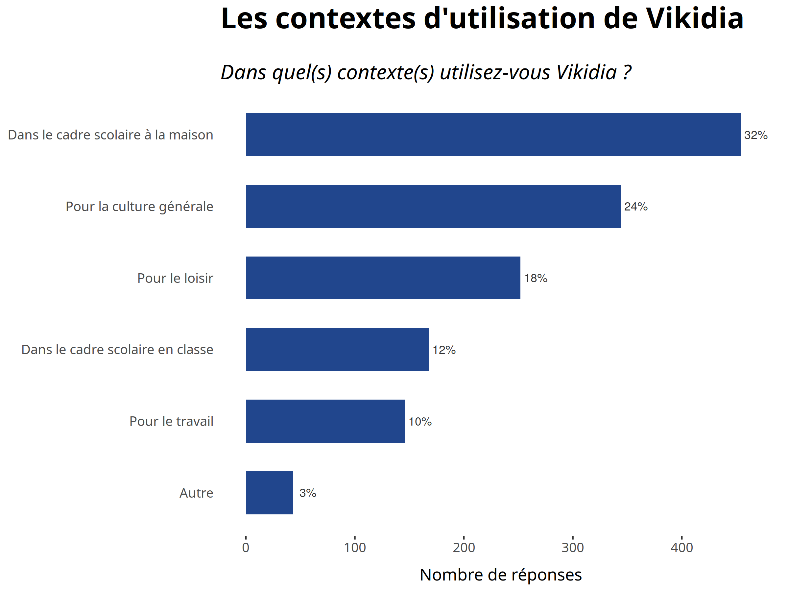

La visualisation ci-dessus montre . 


------------------------------------------------------------------------

<br>

## Degré de contribution des répondants

<br>

-   **population** : tous les répondants

-   **nombre de répondants** : 774

-   **question représentée et ses réponses issues du questionnaire** :

    -   "*Quel est votre degré de contribution ?*" : 'C’est la première fois que je consulte Vikidia', 'Je consulte Vikidia mais je n’ai jamais contribué', 'J’ai déjà contribué une fois ou deux', 'Je contribue de temps en temps (environ une fois par mois, ou moins)', 'Je contribue régulièrement (plusieurs fois par mois)', 'Je contribue très souvent (une fois par semaine ou plus)'

<br>

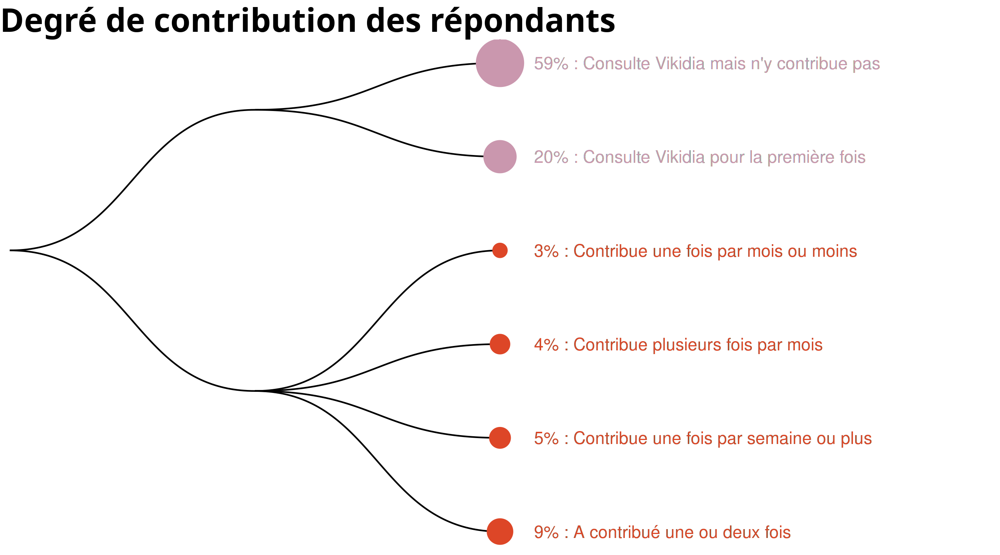

La visualisation ci-dessus montre . 

<br>

------------------------------------------------------------------------

# III - Dresser le profil du contributeur moyen


<br>

## Genre des répondants contributeurs de l'enquête

<br>

-   **population** : les contributeurs

-   **nombre de répondants** : 163

-   **question représentée et ses réponses issues du questionnaire** :

    -   "*Êtes vous ...*" : 'Un homme', 'Une femme', 'Autre', 'Je préfère ne pas le dire'

<br>

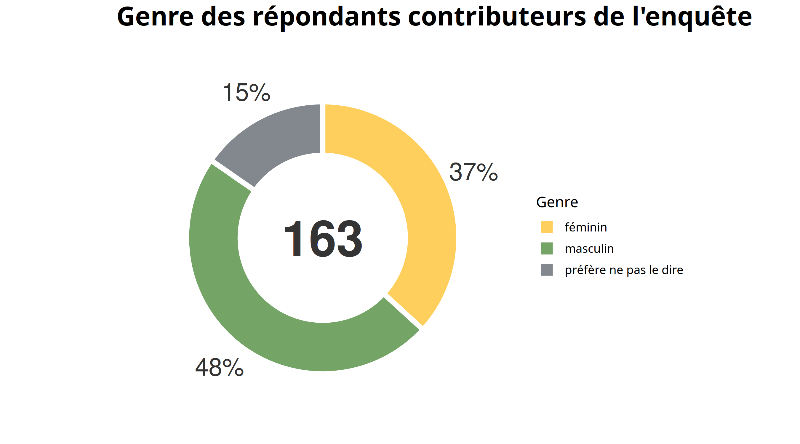

La visualisation ci-dessus montre la répartition des répondants selon leur genre. Sur 774 répondants ; 380 sont des femmes, soit 49%, 285 sont des hommes, soit 37%, et 109 préfèrent ne pas le dire, soit 14%. FINIR

------------------------------------------------------------------------

<br>

## Nombre de contributeurs selon l'âge et le genre

<br>

-   **population** : les contributeurs de genre féminin ou masculin (suppression de la catégorie "*Préfère ne pas le dire*")

-   **nombre de répondants** : 138

-   **questions représentées et leurs réponses issues du questionnaire** :

    -   "*Êtes vous ...*" : 'Un homme', 'Une femme', 'Autre', 'Je préfère ne pas le dire'
    -   "*Quel âge avez-vous ?*" : 'Moins de 8 ans', 'Entre 8 et 13 ans', 'Entre 14 et 18 ans', 'Entre 19 et 25 ans', 'Entre 26 et 35 ans', 'Entre 36 et 50 ans', 'Entre 51 et 60 ans', 'Plus de 60 ans', 'Je préfère ne pas le dire'

<br>

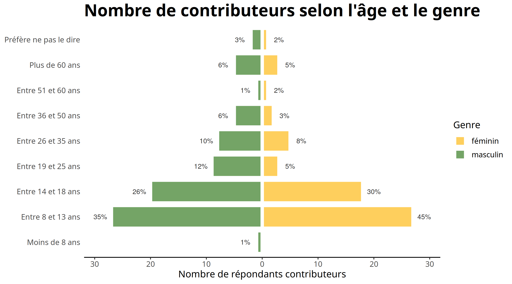

La visualisation ci-dessus montre la répartition des répondants selon leur âge et leur genre. On voit que la catégorie regroupant le plus de répondants est celle des filles ayant entre 14 et 18 ans, qui représente 21% de la population. Elle est suivie par la tranche des moins de 14 ans où l'on retrouve 113 filles, soit 17% des répondants. FINIR


------------------------------------------------------------------------

<br>

## Nombre de contributeurs selon l'activité et le genre

<br>

-   **population** : les contributeurs de genre féminin ou masculin

-   **nombre de répondants** : 138

-   **questions représentées et leurs réponses issues du questionnaire** :

    -   "*Êtes vous ...*" : 'Un homme', 'Une femme', 'Autre', 'Je préfère ne pas le dire'
    -   "*Vous êtes ...*" : 'En activité', 'En recherche d’emploi', 'Retraité', 'Étudiant, élève' ('*Veuillez préciser le niveau d’étude :*' : 'École primaire (du CP au CM2)', 'Collège', 'Lycée', 'Études supérieures')

<br>

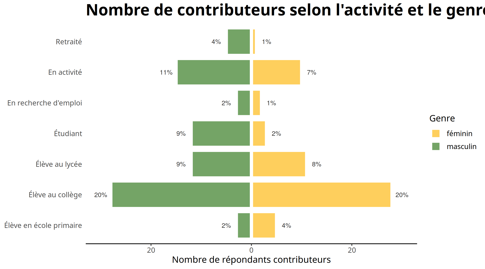

La visualisation ci-dessus montre . 


------------------------------------------------------------------------

<br>

## Les contextes d'utilisation de Vikidia chez les contributeurs

<br>

-   **population** : les contributeurs

-   **nombre de réponses** : 313

-   **question représentée et ses réponses issues du questionnaire** :

    -   "*Dans quel(s) contexte(s) utilisez-vous Vikidia ?*" : 'Dans le cadre scolaire à la maison (voir les devoirs, les révisions etc.)', 'Dans le cadre scolaire en classe (en cours, en club etc.)', 'Pour ma culture générale', 'Pour le travail', 'En tant que simple loisir', 'Autre'

<br>

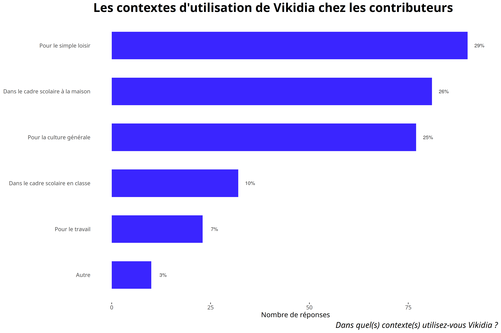

La visualisation ci-dessus montre . 


------------------------------------------------------------------------

## Pourquoi les Vikidiens contribuent

<br>

-   **population** : les contributeurs

-   **nombre de réponses** : 261

-   **question représentée et ses réponses issues du questionnaire** :

    -   "*Pourquoi continuez-vous à contribuer ?*" : 'Je me plais au sein de la communauté', 'J’ai des responsabilités', 'Les domaines abordés m’intéressent', 'J’aime contribuer au projet Vikidia', 'Autre'

<br>

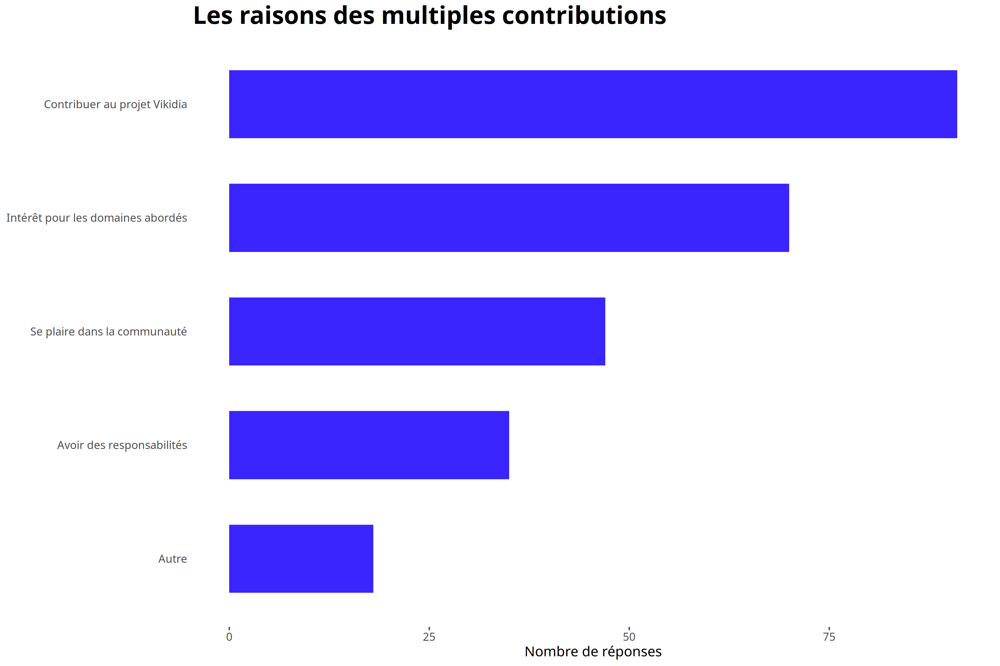

La visualisation ci-dessus montre . 


------------------------------------------------------------------------

<br>

## Contributions apportées à Vikidia selon les responsabilités

<br>

-   **population** : les contributeurs

-   **nombre de réponses** : 441

-   **questions représentées et leurs réponses issues du questionnaire** :

    -   "*Quels types de contributions faites-vous ?*" : 'De la patrouille', 'Ajouts sur la partie plus technique', 'Corrections orthographiques ou typographiques', 'Travail de catégorisation et d’ajouts de portail', 'Création amélioration d’articles', 'Aide aux nouveaux utilisateurs', 'Autre'
    -   "*Avez-vous des outils (responsabilités) ?*" : 'Patrouilleur', 'Administrateur', 'Bureaucrate', 'Vérificateur d’IP', 'Nuker', 'Plus maintenant'

<br>

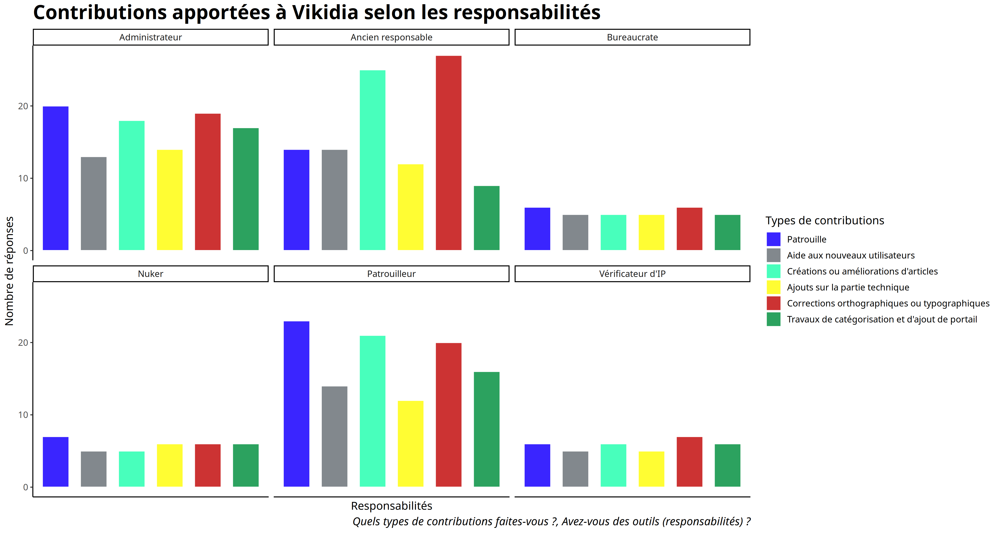

La visualisation ci-dessus montre . 


------------------------------------------------------------------------

<br>

## Nombre de contributeurs ayant rejoint la communauté par année

<br>

-   **population** : les contributeurs (avec une réponse consistante, année comprise entre 2006 et 2021)

-   **nombre de répondants** : 128

-   **questions représentées et leurs réponses issues du questionnaire** :

    -   "*En quelle année avez-vous rejoint la communauté ?*" 
    -   "*Vous êtes ...*" : 'En activité', 'En recherche d’emploi', 'Retraité', 'Étudiant, élève'

<br>

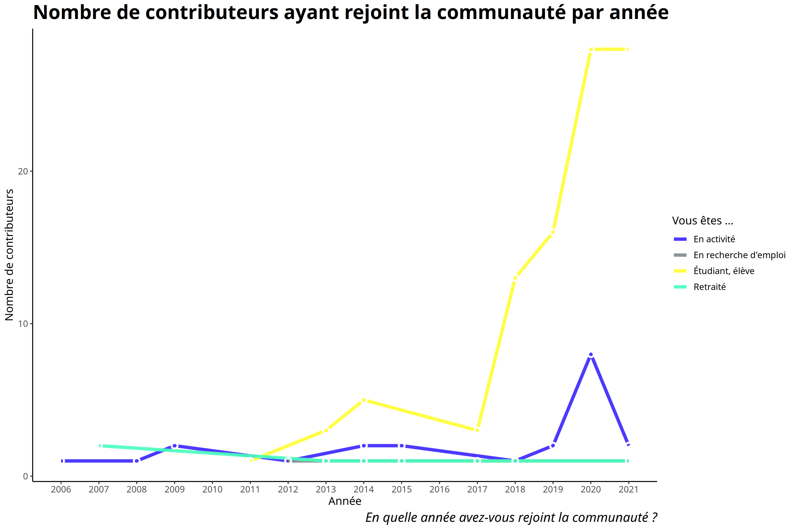

La visualisation ci-dessus montre . 


------------------------------------------------------------------------

<br>

## Nombre de contributeurs scolaires ayant rejoint la communauté par année

<br>

-   **population** : les contributeurs scolaires (avec une réponse consistante, année comprise entre 2006 et 2021)

-   **nombre de répondants** : 97

-   **questions représentées et leurs réponses issues du questionnaire** :

    -   "*En quelle année avez-vous rejoint la communauté ?*" 
    -   "*Veuillez préciser le niveau d’étude :*" : 'École primaire (du CP au CM2)', 'Collège', 'Lycée', 'Études supérieures'

<br>

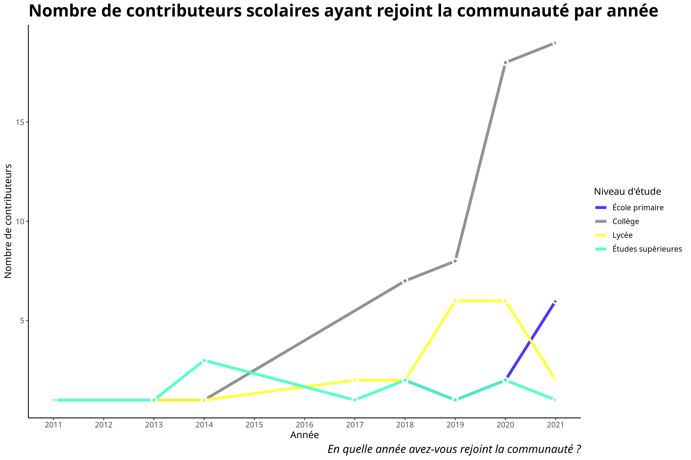

La visualisation ci-dessus montre . 


------------------------------------------------------------------------

<br>

## Nombre de contributeurs ayant rejoint la communauté par année

<br>

-   **population** : les contributeurs (avec une réponse consistante, année comprise entre 2006 et 2021)

-   **nombre de répondants** : 128

-   **questions représentées et leurs réponses issues du questionnaire** :

    -   "*En quelle année avez-vous rejoint la communauté ?*" 
    -   "*Quel est votre degré de contribution ?*" : 'C’est la première fois que je consulte Vikidia', 'Je consulte Vikidia mais je n’ai jamais contribué', 'J’ai déjà contribué une fois ou deux', 'Je contribue de temps en temps (environ une fois par mois, ou moins)', 'Je contribue régulièrement (plusieurs fois par mois)', 'Je contribue très souvent (une fois par semaine ou plus)'

<br>

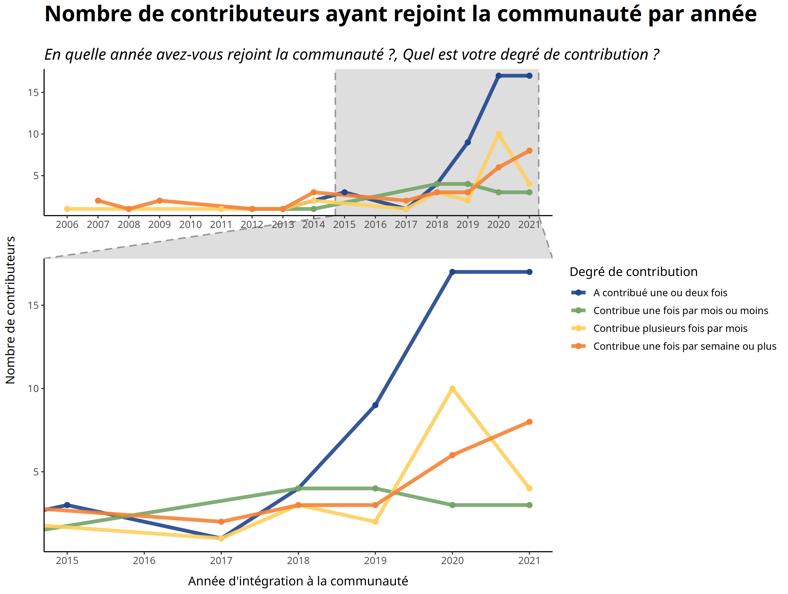

La visualisation ci-dessus montre . 


<br>

------------------------------------------------------------------------

# IV - Cerner les usages


<br>


## Motivations à la contribution

<br>

-   **population** : les contributeurs

-   **nombre de réponses** : 113

-   **question représentée issue du questionnaire** :

    -   "*Qu'est-ce qui vous a motivé à contribuer pour la première fois ?*"

<br>

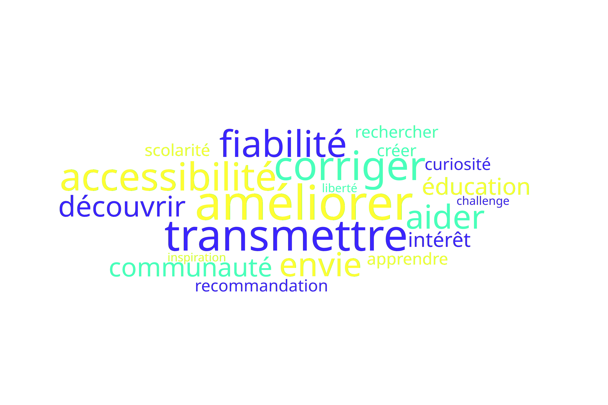

La visualisation ci-dessus montre . 


------------------------------------------------------------------------

<br>

## Canaux par lesquels les répondants ont connu Vikidia

<br>

-   **population** : tous les répondants

-   **nombre de réponses** : 1007

-   **question représentée et ses réponses issues du questionnaire** :

    -   "*Comment avez-vous entendu parler de Vikidia pour la première fois ?*" : 'Par votre milieu professionnel', 'Par votre milieu scolaire, étudiant', 'Par vos proches', 'Par hasard au gré de vos navigations sur internet', 'Par Wikipédia', 'Autre'

<br>

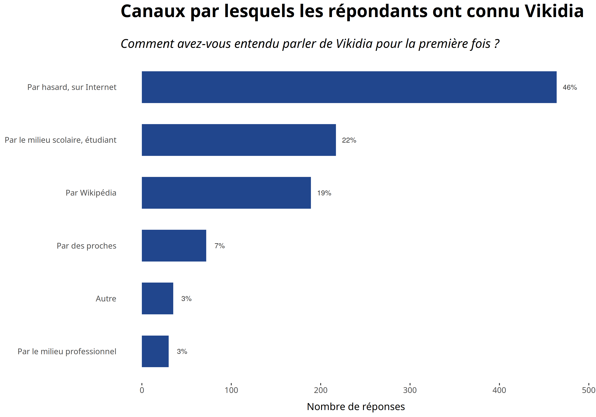

La visualisation ci-dessus montre . 


------------------------------------------------------------------------

<br>

## Niveau de popularité estimé par le répondant, selon qu'il parle de Vikidia autour de lui

<br>

-   **population** : tous les répondants (suppression des réponses '*Autre*' pour le niveau de popularité estimé)

-   **nombre de répondants** : 730

-   **questions représentées et leurs réponses issues du questionnaire** :

    -   "*Quel est le niveau de popularité de Vikidia dans le grand public selon vous ?*" : 'Personne ne connaît Vikidia en dehors de la communauté', 'Vikidia est peu connue, et le grand public en est méfiant', 'Vikidia devrait gagner à être mieux connue', 'Vikidia est de plus en plus connue et elle gagne en confiance', 'Tout le monde connaît Vikidia !', 'Autre'
    -   "*Vous êtes ...*" : 'En activité', 'En recherche d’emploi', 'Retraité', 'Étudiant, élève' ('*Veuillez préciser le niveau d’étude :*' : 'École primaire (du CP au CM2)', 'Collège', 'Lycée', 'Études supérieures')

<br>

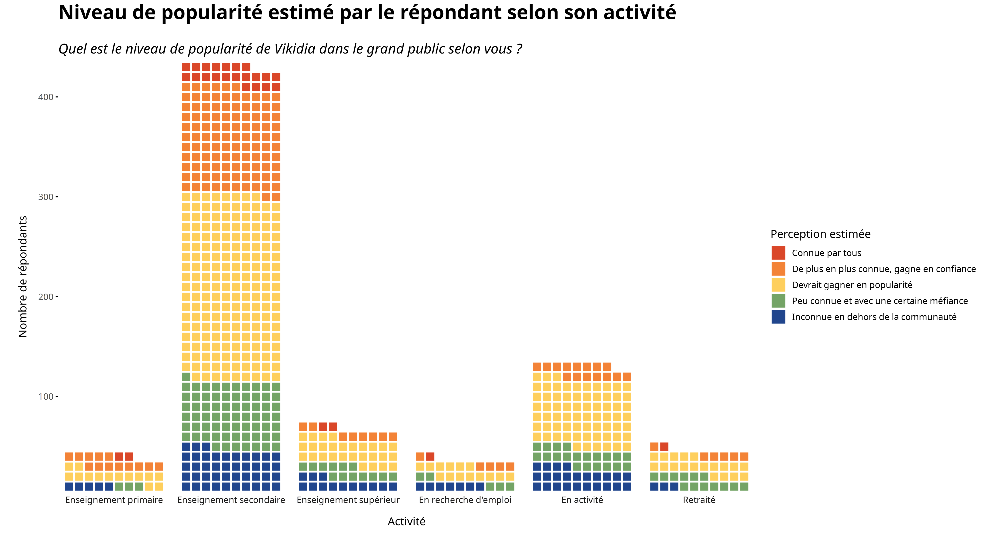

La visualisation ci-dessus montre . 


------------------------------------------------------------------------

<br>

## Pourquoi les Vikidiens utilisent l'outil

<br>

-   **population** : tous les répondants

-   **nombre de réponses** : 1080

-   **questions représentées et leurs réponses issues du questionnaire** :

    -   "*Pourquoi consultez vous plutôt les articles sur Vikidia plutôt que Wikipédia ?*" : 'Les articles y sont plus faciles à comprendre', 'Vikidia est plus adaptée à mon niveau/âge', 'Je préfère l’ambiance au sein de la communauté vikidienne', 'La communauté vikidienne est de plus petite taille', 'Je préfère Wikipédia', 'Autre'
    -   "*"*Quel âge avez-vous ?*" : 'Moins de 8 ans', 'Entre 8 et 13 ans', 'Entre 14 et 18 ans', 'Entre 19 et 25 ans', 'Entre 26 et 35 ans', 'Entre 36 et 50 ans', 'Entre 51 et 60 ans', 'Plus de 60 ans', 'Je préfère ne pas le dire'

<br>

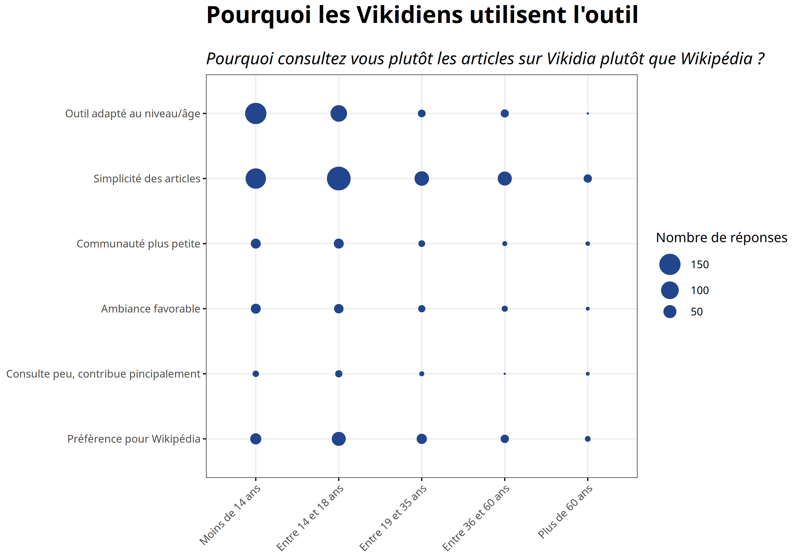

La visualisation ci-dessus montre . 


------------------------------------------------------------------------

<br>

## Pourquoi les Vikidiens utilisent l'outil

<br>

-   **population** : les répondants de genre féminin ou masculin, consultant Vikidia pour l'ambiance favorable ou la taille de communauté

-   **nombre de réponses** : 491

-   **questions représentées et leurs réponses issues du questionnaire** :

    -   "*Pourquoi consultez vous plutôt les articles sur Vikidia plutôt que Wikipédia ?*" : 'Un homme'
    -   "*Quel âge avez-vous ?*" : 'Moins de 8 ans', 'Entre 8 et 13 ans', 'Entre 14 et 18 ans', 'Entre 19 et 25 ans', 'Entre 26 et 35 ans', 'Entre 36 et 50 ans', 'Entre 51 et 60 ans', 'Plus de 60 ans', 'Je préfère ne pas le dire'

<br>

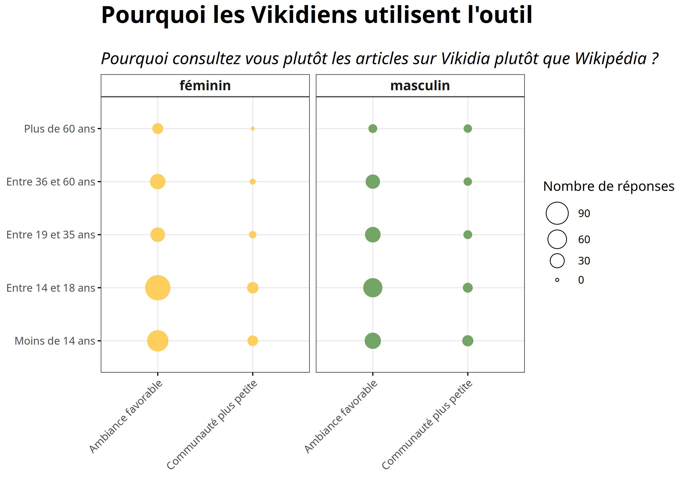

La visualisation ci-dessus montre . 


------------------------------------------------------------------------

<br>

## Type de ressources utilisées comme alternatives à Vikidia

<br>

-   **population** : tous les répondants

-   **nombre de réponses** : 775

-   **question représentée issue du questionnaire** :

    -   "*Lorsque vous ne trouvez pas des informations sur Vikidia, où allez-vous en priorité ?*"

<br>

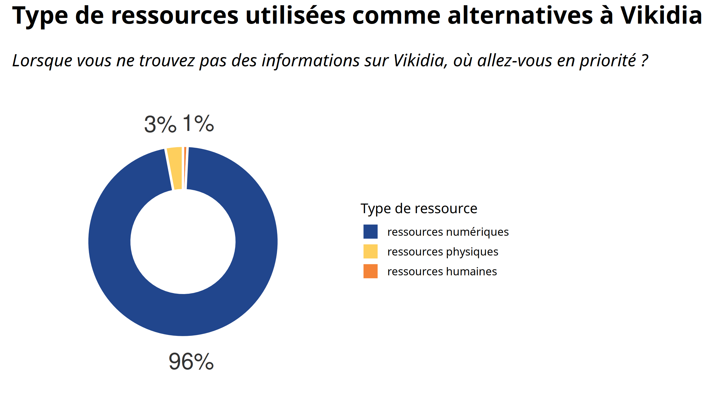
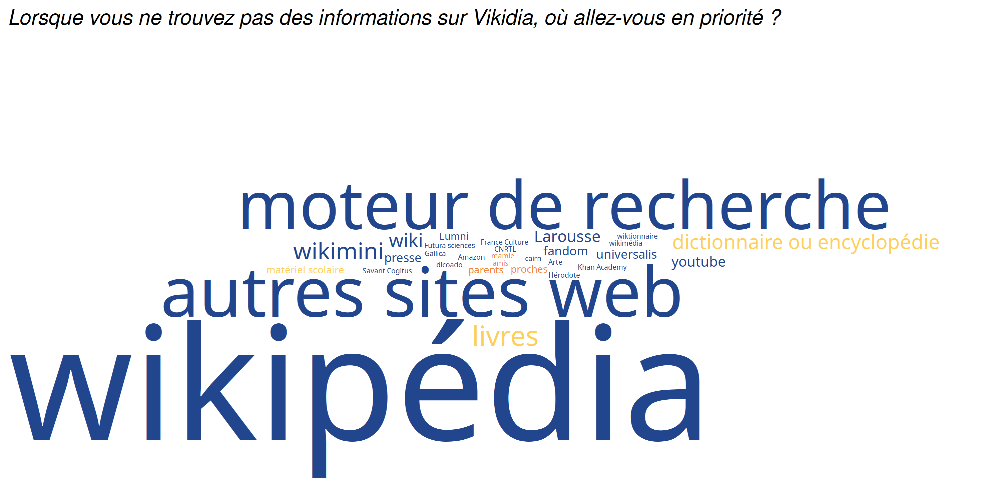

Les visualisations ci-dessus montrent . 


<br>

------------------------------------------------------------------------

# V - Analyser les besoins des utilisateurs


<br>


## Évaluation de l'accessibilité des articles selon l'âge

<br>

-   **population** : tous les répondants

-   **nombre de répondants** : 774

-   **questions représentées et leurs réponses issues du questionnaire** :

    -   "*Trouvez-vous les articles de Vikidia accessibles ?*" : 'Pas du tout accessible', 'Peu accessibles', 'Moyennement accessibles', 'Plutôt accessibles', 'Très accessibles'
    -   "*Quel âge avez-vous ?*" : 'Moins de 8 ans', 'Entre 8 et 13 ans', 'Entre 14 et 18 ans', 'Entre 19 et 25 ans', 'Entre 26 et 35 ans', 'Entre 36 et 50 ans', 'Entre 51 et 60 ans', 'Plus de 60 ans', 'Je préfère ne pas le dire'

<br>

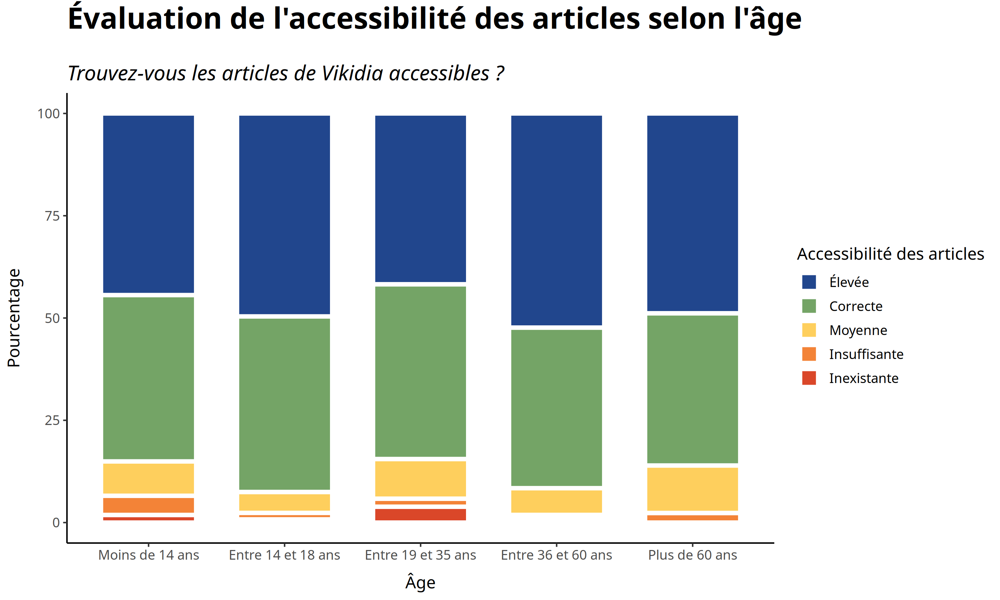

La visualisation ci-dessus montre . 


------------------------------------------------------------------------

<br>

## Participation aux canaux de discussion

<br>

-   **population** : tous les répondants

-   **nombre de répondants** : 774

-   **questions représentées et leurs réponses issues du questionnaire** :

    -   "*Comment évaluez vous votre participation aux canaux de discussion ?*" : 'Quels canaux de discussion ?', 'Je les connais mais je n’y ai jamais participé', 'J’ai déjà écrit un ou deux messages', 'Il m’arrive de répondre aux messages', 'Je suis plutôt actif.ve sur les canaux', 'Je suis très actif.ve sur les canaux'
    -   "*Quel est votre degré de contribution ?*" : 'C’est la première fois que je consulte Vikidia', 'Je consulte Vikidia mais je n’ai jamais contribué', 'J’ai déjà contribué une fois ou deux', 'Je contribue de temps en temps (environ une fois par mois, ou moins)', 'Je contribue régulièrement (plusieurs fois par mois)', 'Je contribue très souvent (une fois par semaine ou plus)'

<br>

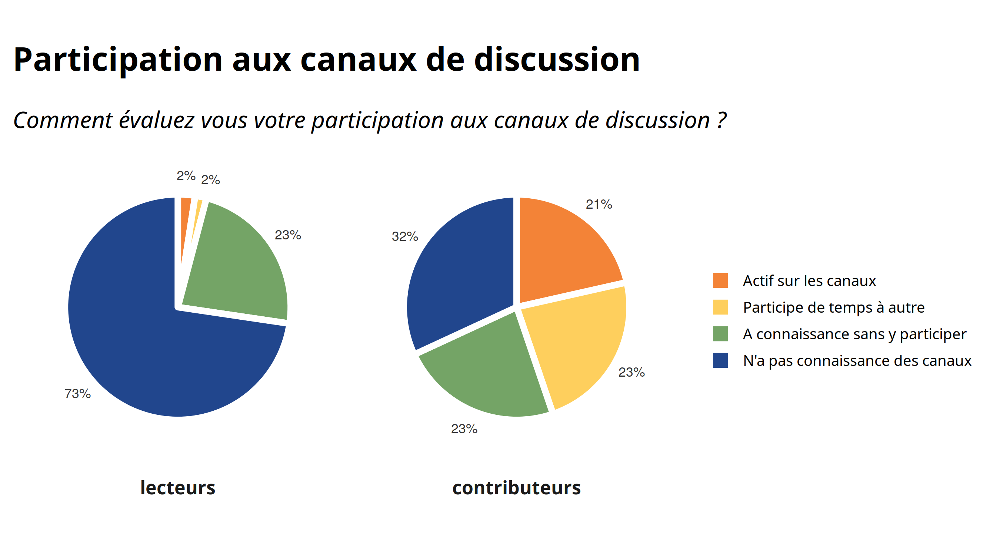

La visualisation ci-dessus montre . 


------------------------------------------------------------------------

<br>

## Avis sur les pages d'aide

<br>

-   **population** : tous les répondants

-   **nombre de répondants** : 774

-   **questions représentées et leurs réponses issues du questionnaire** :

    -   "*Que pensez-vous des pages d'aide ?*" : 'Je n’en ai jamais eu besoin', 'Elles sont suffisamment claires', 'Je ne les trouve pas utiles', 'Elles sont trop complexes', 'Il existe des pages d’aide ???', 'Je pense qu’elles pourraient être améliorées'
    -   "*Quel est votre degré de contribution ?*" : 'C’est la première fois que je consulte Vikidia', 'Je consulte Vikidia mais je n’ai jamais contribué', 'J’ai déjà contribué une fois ou deux', 'Je contribue de temps en temps (environ une fois par mois, ou moins)', 'Je contribue régulièrement (plusieurs fois par mois)', 'Je contribue très souvent (une fois par semaine ou plus)'

<br>

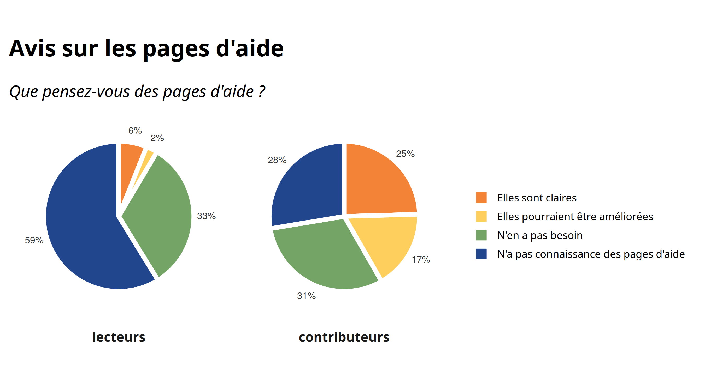

La visualisation ci-dessus montre . 


------------------------------------------------------------------------

<br>

## Avis sur les pages d'aide selon la participation aux canaux de discussion

<br>

-   **population** : tous les répondants

-   **nombre de répondants** : 774

-   **questions représentées et leurs réponses issues du questionnaire** :

    -   "*Comment évaluez vous votre participation aux canaux de discussion ?*" : 'Quels canaux de discussion ?', 'Je les connais mais je n’y ai jamais participé', 'J’ai déjà écrit un ou deux messages', 'Il m’arrive de répondre aux messages', 'Je suis plutôt actif.ve sur les canaux', 'Je suis très actif.ve sur les canaux'
    -   "*Que pensez-vous des pages d'aide ?*" : 'Je n’en ai jamais eu besoin', 'Elles sont suffisamment claires', 'Je ne les trouve pas utiles', 'Elles sont trop complexes', 'Il existe des pages d’aide ???', 'Je pense qu’elles pourraient être améliorées'

<br>

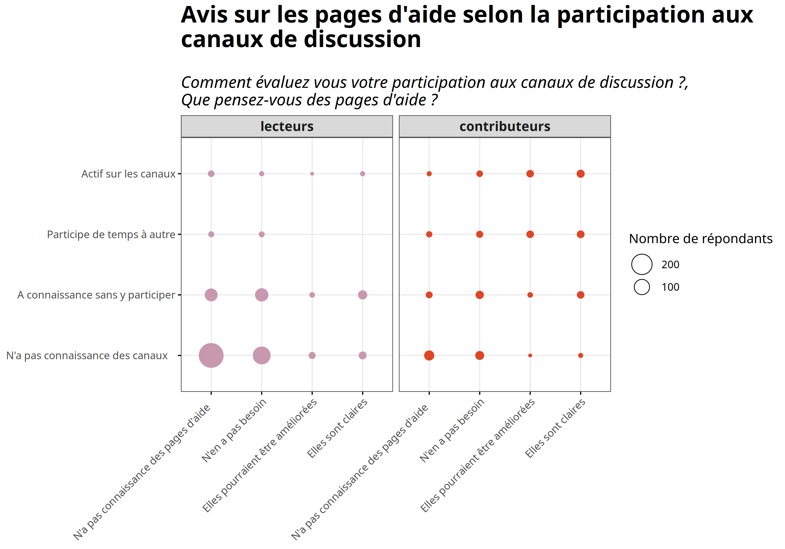

La visualisation ci-dessus montre . 


------------------------------------------------------------------------

<br>

## Part des personnes se sentant intégrées à la communauté de Vikidia, selon s'ils contribuent ou pas à Vikidia

<br>

-   **population** : les répondants se sentant intégrés à la communauté

-   **nombre de répondants** : 548

-   **question représentée et ses réponses issues du questionnaire** :

    -   "*Vous sentez-vous suffisamment intégré à la communauté vikidienne ?*" : 'Oui', 'Non'

<br>

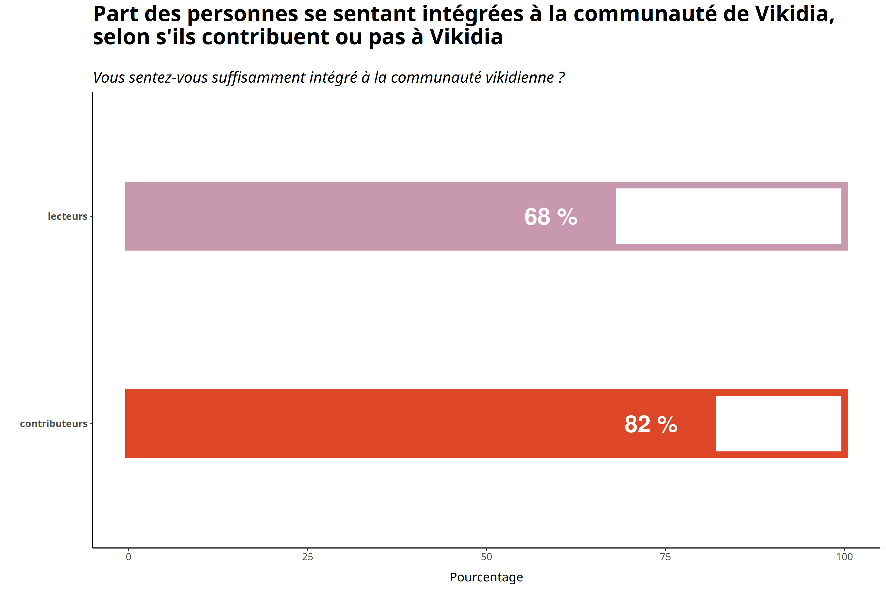

La visualisation ci-dessus montre . 


------------------------------------------------------------------------

<br>

## Évaluation de l'accessibilité des articles par les lecteurs se sentant integrés à la communauté

<br>

-   **population** : les lecteurs se sentant intégrés à la communauté

-   **nombre de répondants** : 414

-   **question représentée et ses réponses issues du questionnaire** :

    -   "*Trouvez-vous les articles de Vikidia accessibles ?*" : 'Pas du tout accessibles', 'Peu accessibles', 'Moyennement accessibles', 'Plutôt accessibles', 'Très accessibles'

<br>

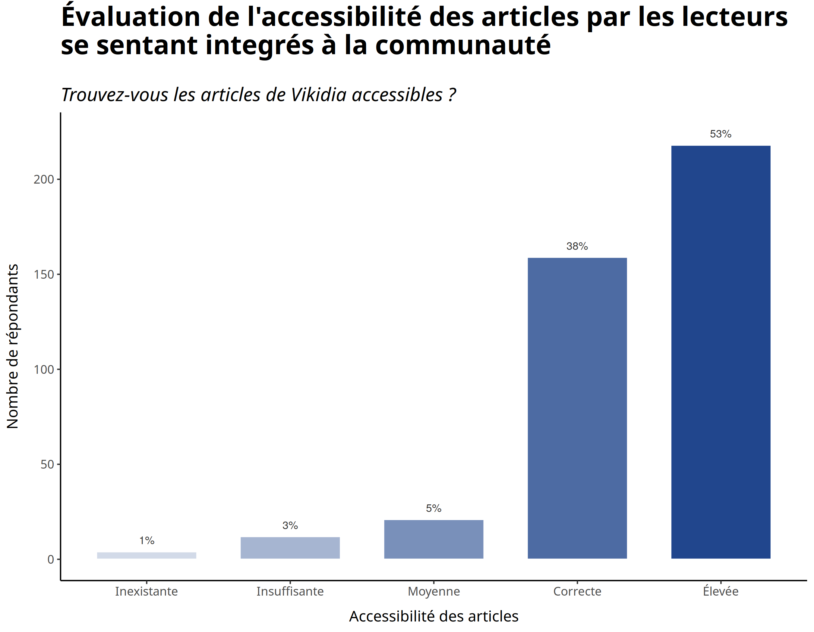

La visualisation ci-dessus montre . 


------------------------------------------------------------------------

<br>

## Participation des contributeurs se sentant integrés à la communauté, aux canaux de discussion

<br>

-   **population** : les contributeurs se sentant intégrés à la communauté

-   **nombre de répondants** : 134

-   **question représentée et ses réponses issues du questionnaire** :

    -   "*Comment évaluez vous votre participation aux canaux de discussion ?*" : 'Quels canaux de discussion ?', 'Je les connais mais je n’y ai jamais participé', 'J’ai déjà écrit un ou deux messages', 'Il m’arrive de répondre aux messages', 'Je suis plutôt actif.ve sur les canaux', 'Je suis très actif.ve sur les canaux'

<br>

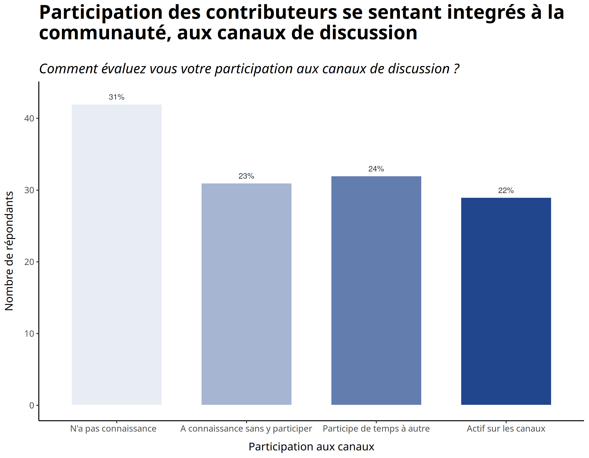

La visualisation ci-dessus montre . 


------------------------------------------------------------------------

<br>

## Évaluation de l'accueil sur Vikidia

<br>

-   **population** : les répondants de genre féminin ou masculin

-   **nombre de répondants** : 665

-   **question représentée et ses réponses issues du questionnaire** :

    -   "*Comment avez vous jugé votre accueil sur Vikidia ?*" : 'Excellent', 'Bon', 'Moyen', 'Laisse à désirer'

<br>

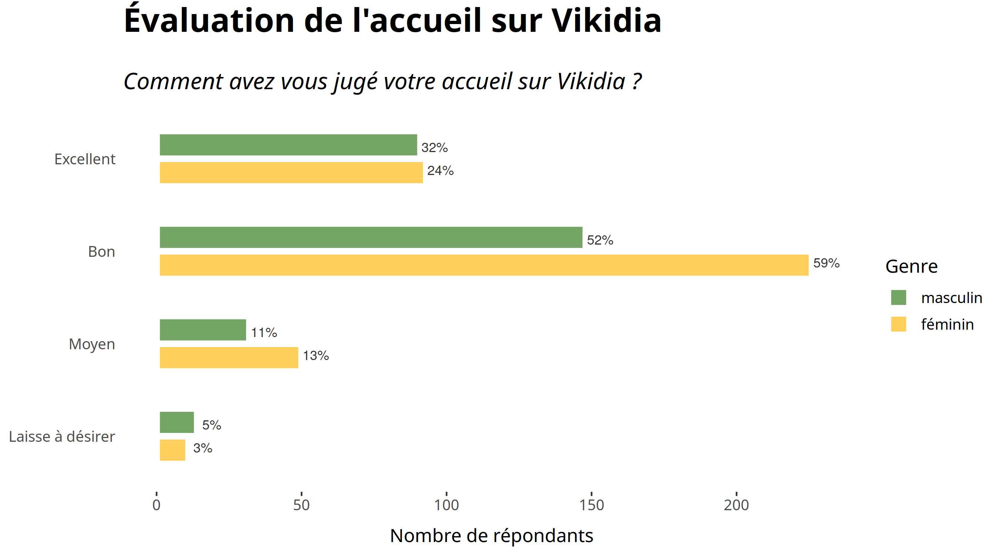

La visualisation ci-dessus montre . 


------------------------------------------------------------------------

<br>

## Canaux de discussion des répondants selon l'âge et le genre

<br>

-   **population** : les répondants ayant précisé leur âge (suppression de la catégorie “Préfère ne pas le dire”) et participant aux canaux de discussion

-   **nombre de répondants** : 639

-   **questions représentées et leurs réponses issues du questionnaire** :

    -   "*Sur quel(s) canal(ux) de discussions êtes-vous actif.ve ?*" : 'Discord', 'Les Bavardages', 'IRC', 'Pages de discussion', 'Autre(s) canaux de discussion ?'
    -   "*Quel âge avez-vous ?*" : 'Moins de 8 ans', 'Entre 8 et 13 ans', 'Entre 14 et 18 ans', 'Entre 19 et 25 ans', 'Entre 26 et 35 ans', 'Entre 36 et 50 ans', 'Entre 51 et 60 ans', 'Plus de 60 ans', 'Je préfère ne pas le dire'

<br>

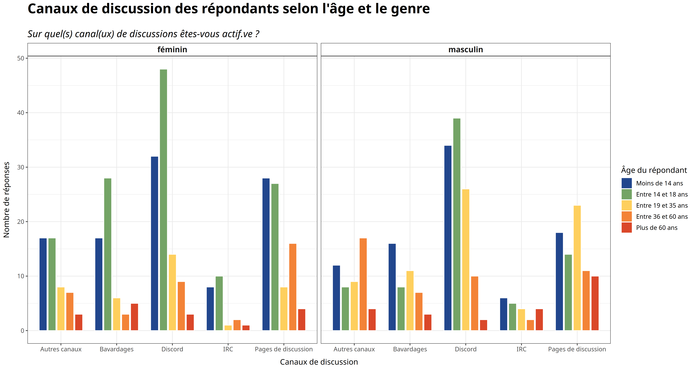

La visualisation ci-dessus montre . 
Préciser : premier traitement pour supprimer les réponses "autres" qui veulent dire 'aucun'.


------------------------------------------------------------------------

<br>

## Évaluation de Vikidia par ses lecteurs

<br>

-   **population** : les lecteurs

-   **nombre de répondants** : 611

-   **question représentée et ses réponses issues du questionnaire** :

    -   "*Veuillez noter votre satisfaction sur les sujets suivants*" : 'la qualité des articles', 'l’accessibilité des sujets traités', 'la qualité et la pertinence des illustrations', 'la diversité des sujets traités', 'la qualité syntaxique et typographique', 'Le projet Vikidia en général'

<br>

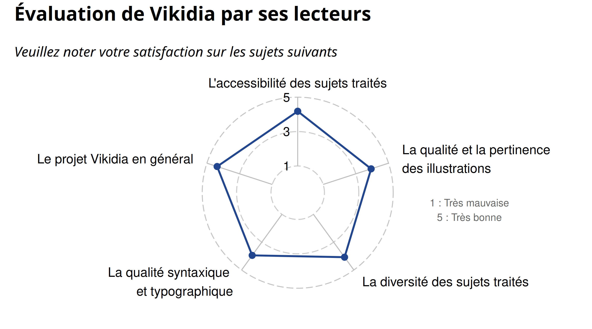

La visualisation ci-dessus montre . 
Préciser : pas de diférence dans la note attribuée par groupe (lectuers/contrib, age, activite etC.)


------------------------------------------------------------------------

<br>

## Évaluation de la fiabilité des articles

<br>

-   **population** : tous les répondants

-   **nombre de répondants** : 774

-   **question représentée et ses réponses issues du questionnaire** :

    -   "*Quel est votre niveau de confiance en ce qui concerne la fiabilité des articles de Vikidia ?*" : 'Je me méfie des informations que je trouve sur Vikidia', 'Les articles de Vikidia sont plutôt fiables', 'Les articles de Vikidia sont tout à fait fiables', 'Les informations trouvées sur Vikidia ne sont pas toujours fiables', 'Les informations trouvées sur Vikidia sont à prendre avec précaution'

<br>

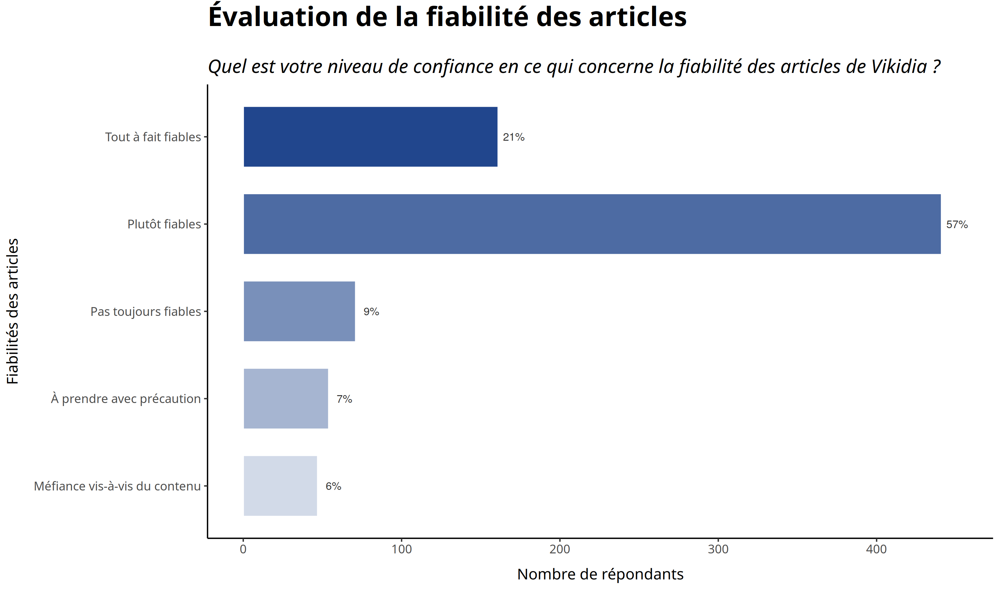

La visualisation ci-dessus montre . 


------------------------------------------------------------------------

<br>

## Évaluation de la fiabilité des articles selon l'activité

<br>

-   **population** : tous les répondants

-   **nombre de répondants** : 774

-   **questions représentées et leurs réponses issues du questionnaire** :

    -   "*Quel est votre niveau de confiance en ce qui concerne la fiabilité des articles de Vikidia ?*" : 'Je me méfie des informations que je trouve sur Vikidia', 'Les articles de Vikidia sont plutôt fiables', 'Les articles de Vikidia sont tout à fait fiables', 'Les informations trouvées sur Vikidia ne sont pas toujours fiables', 'Les informations trouvées sur Vikidia sont à prendre avec précaution'
    -   "*Vous êtes ...*" : 'En activité', 'En recherche d’emploi', 'Retraité', 'Étudiant, élève' ('*Veuillez préciser le niveau d’étude :*' : 'École primaire (du CP au CM2)', 'Collège', 'Lycée', 'Études supérieures')

<br>

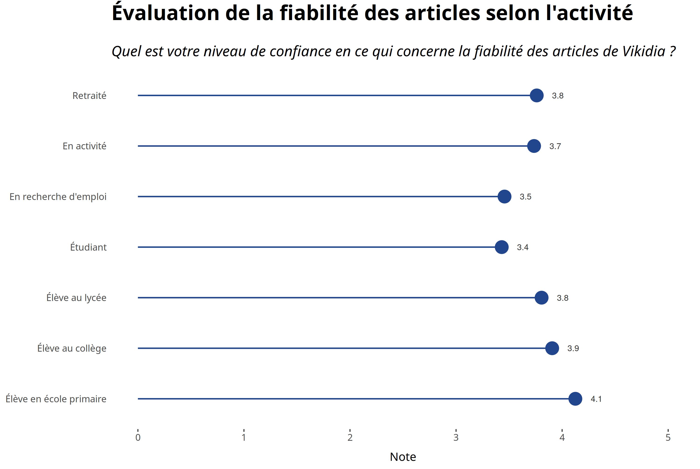

La visualisation ci-dessus montre . 


------------------------------------------------------------------------

<br>

## Évaluation de la fiabilité des articles selon l'âge

<br>

-   **population** : les répondants ayant précisé leur âge

-   **nombre de répondants** : 721

-   **questions représentées et leurs réponses issues du questionnaire** :

    -   "*Quel est votre niveau de confiance en ce qui concerne la fiabilité des articles de Vikidia ?*" : 'Je me méfie des informations que je trouve sur Vikidia', 'Les articles de Vikidia sont plutôt fiables', 'Les articles de Vikidia sont tout à fait fiables', 'Les informations trouvées sur Vikidia ne sont pas toujours fiables', 'Les informations trouvées sur Vikidia sont à prendre avec précaution'
    -   "*Quel âge avez-vous ?*" : 'Moins de 8 ans', 'Entre 8 et 13 ans', 'Entre 14 et 18 ans', 'Entre 19 et 25 ans', 'Entre 26 et 35 ans', 'Entre 36 et 50 ans', 'Entre 51 et 60 ans', 'Plus de 60 ans', 'Je préfère ne pas le dire'

<br>


La visualisation ci-dessus montre . 


<br>


<div class="tocify-extend-page" data-unique="tocify-extend-page" style="height: 0;"></div>
